  <h2>Universidade Federal de Itajubá (UNIFEI)</h2>
  
Engenharia de Controle e Automação | Disciplina: Automática

  
Projeto: SCADA - Máquina de Envasamento de Copos Plásticos

  

# Mapeamento de Variáveis de Processo para Proposições Lógicas

Na automação industrial (norma ISA-5.1), instrumentos e atuadores emitem e recebem sinais discretos (binários: 0 = Falso / 1 = Verdadeiro). Abaixo, as variáveis da planta de envasamento de copos são discretizadas em proposições lógicas para a programação e intertravamento no sistema de controle:

## Diagrama P&ID Simplificado do Sistema

```mermaid
flowchart TD
    %% Setor 000: Mesa Giratória e Controle
    subgraph S0 [Setor 000: Controle Geral]
        M001[Motor da Mesa] -->|Indexa| MESA((Mesa<br>Giratória))
        SE001[Encoder] -.->|Precisão| M001
        PAINEL[Painel: Botões e LEDs] -.->|Interface SCADA| MESA
    end

    %% Setor 100: Dispensa de Copo
    subgraph S1 [Setor 100: Dispensa]
        XV101[Cilindro A<br>Retentor] -->|Avança/Recua| MESA
        ZSC101[2x Sensores Mag.] -.->|Posição| XV101
        ZS102[Sensor Capacitivo] -.->|Presença Copo| MESA
    end

    %% Setor 200: Envase de Água
    subgraph S2 [Setor 200: Envase e Dosagem]
        ZS200[Sensor Capacitivo] -.->|Presença Copo| MESA
        XV201[Cilindro B<br>Direcionamento] -->|Válvula 3 vias| XV202
        ZSC201[1x Sensor Mag.] -.->|Posição| XV201
        XV202[Cilindro C<br>Dosador 150ml] -->|Empurra Dose| XV203
        ZSC202[2x Sensores Mag.] -.->|Avanço/Recuo| XV202
        XV203[Cilindro Bico] -->|Abre/Fecha| MESA
        ZSC203[1x Sensor Mag.] -.->|Posição| XV203
    end

    %% Setor 300: Pick-and-Place
    subgraph S3 [Setor 300: Posicionamento Tampa]
        ZS300[Sensor Capacitivo] -.->|Presença Copo| MESA
        XV301[Cilindro D<br>Giro] -->|Gira Braço| BRACO{Manipulador}
        ZSC301[2x Sensores Mag.] -.->|Captura/Entrega| XV301
        XV302[Cilindro E<br>Vertical] -->|Sobe/Desce| BRACO
        ZSC302[2x Sensores Mag.] -.->|Avanço/Recuo| XV302
        VAC301[Válvula Vácuo] -->|Sucção| BRACO
        PIT301[Pressostato] -.->|Confirma Adesão| BRACO
        BRACO -->|Posiciona Tampa| MESA
    end

    %% Setor 400: Termosselagem
    subgraph S4 [Setor 400: Termosselagem]
        ZS400[Sensor Capacitivo] -.->|Presença Copo| MESA
        XV401[Cilindro F<br>Prensa] -->|Pressão| CABECOTE{Cabeçote}
        ZSC401[2x Sensores Mag.] -.->|Avanço/Recuo| XV401
        HT401[Resistência] -->|Calor| CABECOTE
        TIT401[Sensor Temp.] -.->|Monitora| CABECOTE
        CABECOTE -->|Sela 2s| MESA
    end

    %% Setor 500: Ejeção
    subgraph S5 [Setor 500: Ejeção]
        ZS500[Sensor Capacitivo] -.->|Presença Copo| MESA
        XV501[Cilindro G<br>Elevador Vertical] -->|Sobe Copo| MESA
        ZSC501[2x Sensores Mag.] -.->|Avanço/Recuo| XV501
        XV502[Cilindro H<br>Transferência Horiz.] -->|Empurra| ESTEIRA
        ZSC502[2x Sensores Mag.] -.->|Avanço/Recuo| XV502
        M501[Motor Esteira] -->|Transporta| ESTEIRA
    end

    %% Sincronismo da Mesa
    S1 -.->|Avança Indexador| S2 -.->|Avança Indexador| S3 -.->|Avança Indexador| S4 -.->|Avança Indexador| S5
```

### Setor 000: Controle Geral do Processo
| Tag | Dispositivo | Lógica | Estado 1 |
| :--- | :--- | :--- | :--- |
| M-001 | Motor da mesa indexadora | *m0* | Motor LIGADO |
| M-002 | Motor da esteira de saída | *m1* | Motor LIGADO |
| SE-001 | Sensor de posição (Encoder) | *p0* | Mesa na posição correta |
| HS-001 | Botão Ligar | *b1* | Pressionado |
| HS-002 | Botão Desligar | *b2* | Pressionado |
| HS-003 | Botão Parar | *b3* | Pressionado |
| HS-004 | Botão Emergência | *e1* | Pressionado |
| HS-005 | Chave Energizada | *k1* | LIGADA |
| IL-001 | LED Ligado | *l1* | Aceso |
| IL-002 | LED Emergência | *l2* | Aceso |
| IL-003 | LED Energizado | *l3* | Aceso |

### Setor 100: Dispensa de Copo
| Tag | Dispositivo | Lógica | Estado 1 |
| :--- | :--- | :--- | :--- |
| XV-101 | Válvula (Cilindro A) | *v1* | Cilindro RECUADO (Libera copo) |
| ZSC-101 | Sensor Mag. (Cil. A Avanço) | *c1a* | Cilindro avançado |
| ZSO-101 | Sensor Mag. (Cil. A Recuo) | *c1r* | Cilindro recuado |
| ZS-102 | Sensor Capacitivo | *s1* | Copo presente na mesa |

### Setor 200: Envase de Água
| Tag | Dispositivo | Lógica | Estado 1 |
| :--- | :--- | :--- | :--- |
| ZS-200 | Sensor Capacitivo | *s2* | Copo presente na mesa |
| XV-201 | Válvula 3 vias (Cilindro B) | *v2* | Direcionada p/ bico |
| ZSC-201 | Sensor Mag. (Cil. B) | *c2* | Posição alcançada |
| XV-202 | Dosador (Cilindro C) | *v3* | Dosador AVANÇA |
| ZSC-202 | Sensor Mag. (Cil. C Recuo) | *c3r* | Dosador recuado |
| ZSO-202 | Sensor Mag. (Cil. C Avanço) | *c3a* | Dosador avançado |
| XV-203 | Válvula do Bico | *v4* | Bico ABRE |
| ZSC-203 | Sensor Mag. (Bico) | *c4* | Bico aberto detectado |

### Setor 300: Pick-and-Place (Tampa)
| Tag | Dispositivo | Lógica | Estado 1 |
| :--- | :--- | :--- | :--- |
| ZS-300 | Sensor Capacitivo | *s3* | Copo presente na mesa |
| XV-301 | Giro (Cilindro D) | *v5* | Braço em 180° (Entrega) |
| ZSC-301 | Sensor Mag. (Cil. D 0°) | *c5r* | Braço em 0° (Captura) |
| ZSO-301 | Sensor Mag. (Cil. D 180°) | *c5a* | Braço em 180° (Entrega) |
| XV-302 | Vertical (Cilindro E) | *v6* | Vertical AVANÇA |
| ZSC-302 | Sensor Mag. (Cil. E Recuo) | *c6r* | Vertical recuado |
| ZSO-302 | Sensor Mag. (Cil. E Avanço) | *c6a* | Vertical avançado |
| VAC-301 | Válvula de Vácuo | *v7* | Vácuo LIGADO |
| PIT-301 | Pressostato de Vácuo | *p1* | Tampa capturada |

### Setor 400: Termosselagem
| Tag | Dispositivo | Lógica | Estado 1 |
| :--- | :--- | :--- | :--- |
| ZS-400 | Sensor Capacitivo | *s4* | Copo presente na mesa |
| XV-401 | Prensa (Cilindro F) | *v8* | Prensa AVANÇA |
| ZSC-401 | Sensor Mag. (Prensa Recuo) | *c7r* | Prensa recuada |
| ZSO-401 | Sensor Mag. (Prensa Avanço)| *c7a* | Prensa avançada |
| HT-401 | Resistência Cartucho | *h1* | Resistência LIGADA |
| TIT-401 | Sensor de Temperatura | *t1* | Temp. >= 180°C |

### Setor 500: Ejeção
| Tag | Dispositivo | Lógica | Estado 1 |
| :--- | :--- | :--- | :--- |
| ZS-500 | Sensor Capacitivo | *s5* | Copo presente na mesa |
| XV-501 | Elevador (Cilindro G) | *v9* | Elevador AVANÇA |
| ZSC-501 | Sensor Mag. (Cil. G Recuo) | *c8r* | Elevador recuado |
| ZSO-501 | Sensor Mag. (Cil. G Avanço)| *c8a* | Elevador avançado |
| XV-502 | Extrator (Cilindro H) | *v10* | Extrator RECUA |
| ZSC-502 | Sensor Mag. (Cil. H Avanço)| *c9a* | Extrator avançado |
| ZSO-502 | Sensor Mag. (Cil. H Recuo) | *c9r* | Extrator recuado |
