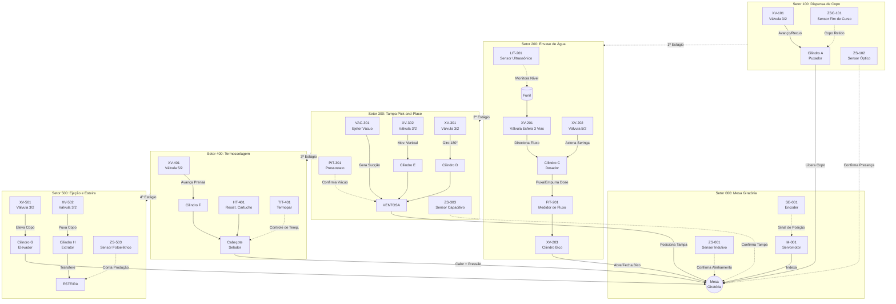

  <h2>Universidade Federal de Itajubá (UNIFEI)</h2>
  
Engenharia de Controle e Automação | Disciplina: Automática

  
Projeto: SCADA - Máquina de Envasamento de Copos Plásticos

  

# Mapeamento de Variáveis de Processo para Proposições Lógicas

Na automação industrial (norma ISA-5.1), instrumentos e atuadores emitem e recebem sinais discretos (binários: 0 = Falso / 1 = Verdadeiro). 

## Diagrama P&ID Simplificado do Sistema

Abaixo, as variáveis da planta de envasamento de copos são discretizadas em proposições lógicas para a programação e intertravamento no sistema de controle:

### Setor 000: Mesa Giratória
| Tag | Dispositivo | Lógica | Estado 1 |
| :--- | :--- | :--- | :--- |
| M-001 | Servomotor | *m0* | Motor LIGADO |
| SE-001 | Encoder Integrado | *p0* | Mesa Indexada |
| ZS-001 | Sensor Indutivo | *z0* | Alojamento alinhado |

### Setor 100: Dispensa de Copo
| Tag | Dispositivo | Lógica | Estado 1 |
| :--- | :--- | :--- | :--- |
| XV-101 | Válvula 3/2 | *v1* | Cilindro recua |
| ZSC-101 | Sensor Mag. | *c1* | Retendo pilha |
| ZS-102 | Sensor Óptico | *s1* | Copo na mesa |

### Setor 200: Envase de Água
| Tag | Dispositivo | Lógica | Estado 1 |
| :--- | :--- | :--- | :--- |
| LIT-201 | Ultrassônico | *l1* | Nível < 38mm |
| XV-201 | Válvula 5/2 | *v2* | Válvula p/ EMPURRAR |
| XV-202 | Válvula 5/2 | *v3* | Dosador AVANÇADO |
| XV-203 | Válvula 3/2 | *v4* | Bico ABERTO |
| ZSC-201 | Sensor Mag. | *c2r* | Dosador recuado |
| ZSO-201 | Sensor Mag. | *c2a* | Dose entregue |
| ZSC-203 | Sensor Mag. | *c3r* | Bico FECHADO |
| ZSO-203 | Sensor Mag. | *c3a* | Bico ABERTO |
| FIT-201 | Med. Fluxo | *f1* | Volume = 150 pulsos |

### Setor 300: Pick-and-Place
| Tag | Dispositivo | Lógica | Estado 1 |
| :--- | :--- | :--- | :--- |
| XV-301 | Válvula 3/2 | *v5* | Braço rot. 180° |
| XV-302 | Válvula 3/2 | *v6* | Vertical AVANÇADO |
| VAC-301 | Ejetor Venturi | *v7* | Ejetor LIGADO |
| PIT-301 | Pressostato | *p1* | Vácuo limite atingido |
| ZSC-301 | Sensor Mag. | *c4r* | Braço em 0° |
| ZSO-301 | Sensor Mag. | *c4a* | Braço em 180° |
| ZS-303 | Capacitivo | *s3* | Tampa sobre copo |

### Setor 400: Termosselagem
| Tag | Dispositivo | Lógica | Estado 1 |
| :--- | :--- | :--- | :--- |
| XV-401 | Válvula 5/2 | *v8* | Prensa AVANÇADA |
| ZSC-401 | Sensor Mag. | *c5r* | Prensa recuada |
| ZSO-401 | Sensor Mag. | *c5a* | Prensa avançada |
| TIT-401 | Termopar | *t1* | Temp. >= 180°C |
| HT-401 | Resist. Cartucho | *h1* | Resistência LIGADA |

### Setor 500: Ejeção
| Tag | Dispositivo | Lógica | Estado 1 |
| :--- | :--- | :--- | :--- |
| XV-501 | Válvula 3/2 | *v9* | Elevador AVANÇADO |
| XV-502 | Válvula 3/2 | *v10* | Extrator AVANÇADO |
| ZSO-501 | Sensor Mag. | *c6a* | Copo na esteira |
| ZSC-502 | Sensor Mag. | *c7r* | Extrator recuado |
| ZS-503 | Fotoelétrico | *s4* | Produto passou (+1) |
