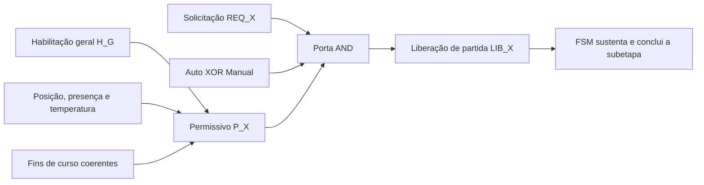

# Aula 04: Lógica Proposicional — Conectivos e Blocos de Permissivos

## 1. Objetivo

Esta etapa aplica os conectivos da lógica proposicional à máquina pneumática de envasamento de copos de água. O objetivo é construir blocos combinacionais que determinem se uma operação **pode começar**, considerando energia, parada de emergência, posição da mesa, presença do copo e posição segura dos atuadores.

O módulo diferencia quatro conceitos que não devem ser tratados como sinônimos:

1. **Solicitação:** intenção de iniciar uma operação, produzida pelo operador ou pela máquina de estados.
2. **Permissivo de partida:** conjunto de condições que deve ser verdadeiro no instante da partida.
3. **Comando liberado:** solicitação aceita porque o permissivo está satisfeito.
4. **Intertravamento contínuo:** condição monitorada durante o movimento; sua perda produz bloqueio ou *trip*.

Formalmente, para uma operação genérica $X$:

$$CMD_X = REQ_X \land P_X$$

e sua regra de segurança pode ser verificada por:

$$CMD_X \rightarrow P_X$$

> A implicação acima valida a consistência de um estado, mas não calcula o comando. O comando é calculado pela conjunção entre solicitação e permissivo.

---

## 2. Conectivos lógicos aplicados

| Conectivo | Símbolo | Interpretação na envasadora |
| :--- | :---: | :--- |
| Negação | $\neg A$ | Condição não ativa, como emergência não acionada |
| Conjunção | $A \land B$ | Todas as condições precisam ser satisfeitas |
| Disjunção | $A \lor B$ | Ao menos uma condição de falha produz alarme ou trip |
| Disjunção exclusiva | $A \oplus B$ | Exatamente um modo deve estar selecionado: automático ou manual |
| Implicação | $A \rightarrow B$ | Se um comando estiver ativo, seu permissivo deve ser verdadeiro |
| Bicondicional | $A \leftrightarrow B$ | Dois estados devem possuir o mesmo valor lógico |

O seletor de modo é válido quando apenas um modo estiver selecionado:

$$M_{valido} = Auto \oplus Manual$$

Dois modos simultâneos ou nenhum modo selecionado constituem configuração inválida.

`Auto`, `Manual` e os sinais $REQ_X$ são variáveis internas do controlador. No modo automático, a FSM gera cada solicitação; no modo manual, a solicitação vem de um comando autorizado da IHM. O botão $b_1$ pode iniciar ou memorizar o ciclo automático, mas não elimina nenhum permissivo.

---

## 3. Habilitação geral

As entradas do painel utilizadas nesta etapa são:

| Proposição | Tag | Significado quando verdadeira |
| :---: | :--- | :--- |
| $k_1$ | HS-005 | Chave geral energizada |
| $e_1$ | HS-004 | Emergência acionada |
| $b_2$ | HS-002 | Botão Desligar pressionado |
| $b_3$ | HS-003 | Botão Parar pressionado |

A habilitação geral para aceitar uma nova partida é:

$$H_G = k_1 \land \neg e_1 \land \neg b_2 \land \neg b_3$$

Nenhum modo manual, manutenção ou supervisório pode eliminar o termo $\neg e_1$.

---

## 4. Permissivo da mesa indexadora — Setor 000

A mesa só pode iniciar uma indexação quando estiver inicialmente posicionada e todos os mecanismos que podem causar colisão estiverem em condição de repouso:

| Condição | Justificativa |
| :--- | :--- |
| $p_0$ | A mesa parte de uma posição indexada válida |
| $c_{1a}$ | Retentor do magazine avançado, impedindo queda durante o giro |
| $c_{3a}$ | Dosador concluiu a descarga de água |
| $\neg c_4$ | Abertura do bico não detectada |
| $c_{5r} \land c_{6r}$ | Braço na captura e eixo vertical recolhido |
| $c_{7r}$ | Prensa térmica recolhida |
| $c_{8r} \land c_{9a}$ | Elevador recolhido e extrator na posição inicial |

Assim:

$$P_{giro} = H_G \land p_0 \land c_{1a} \land c_{3a} \land \neg c_4 \land c_{5r} \land c_{6r} \land c_{7r} \land c_{8r} \land c_{9a}$$

$$LIB_{giro} = REQ_{giro} \land M_{valido} \land P_{giro}$$

O termo $p_0$ é permissivo de **partida**. Durante o deslocamento, $p_0$ naturalmente se torna falso e, por isso, não deve ser usado sozinho para interromper um movimento já iniciado. A parada precisa ocorrer no próximo índice do encoder ou por um intertravamento de segurança.

---

## 5. Permissivos do envase — Setor 200

O envase foi separado em duas liberações sequenciais.

### 5.1. Abertura do bico

O bico pode começar a abrir quando a dose estiver pronta no dosador:

$$P_{bico} = H_G \land p_0 \land s_2 \land c_2 \land c_{3r} \land \neg c_4$$

$$LIB_{bico} = REQ_{bico} \land M_{valido} \land P_{bico}$$

### 5.2. Avanço do dosador

O cilindro C somente pode começar a empurrar a dose após a confirmação de abertura do bico:

$$P_{dose} = H_G \land p_0 \land s_2 \land c_2 \land c_{3r} \land c_4 \land \neg c_{3a}$$

$$LIB_{dose} = REQ_{dose} \land M_{valido} \land P_{dose}$$

O sequenciamento temporal — direcionar a válvula, aspirar, abrir o bico, avançar o dosador e fechar — será responsabilidade da FSM/Grafcet. Estes permissivos apenas autorizam a entrada em cada subetapa.

---

## 6. Permissivo do manipulador de tampas — Setor 300

O braço só pode iniciar o giro de entrega quando houver copo, tampa capturada e eixo vertical recolhido:

$$P_{tampa} = H_G \land p_0 \land s_3 \land p_1 \land c_{5r} \land c_{6r}$$

$$LIB_{tampa} = REQ_{tampa} \land M_{valido} \land P_{tampa}$$

O requisito $c_{6r}$ evita girar o manipulador com a ventosa abaixada, reduzindo o risco de colisão mecânica.

---

## 7. Permissivo da termosselagem — Setor 400

A prensa pode iniciar a descida somente com a mesa estacionada, copo presente e temperatura mínima atingida:

$$P_{prensa} = H_G \land p_0 \land s_4 \land t_1 \land c_{7r}$$

$$LIB_{prensa} = REQ_{prensa} \land M_{valido} \land P_{prensa}$$

Durante o movimento, o intertravamento contínuo mínimo é:

$$I_{prensa} = H_G \land p_0 \land s_4 \land t_1$$

$c_{7r}$ não integra $I_{prensa}$ porque deixa de ser verdadeiro assim que a prensa inicia o avanço. O fim de curso $c_{7a}$ e o temporizador de dois segundos determinam a conclusão da prensagem.

---

## 8. Permissivos da ejeção — Setor 500

### 8.1. Elevação do copo

$$P_{elevador} = H_G \land p_0 \land s_5 \land c_{8r} \land c_{9a}$$

$$LIB_{elevador} = REQ_{elevador} \land M_{valido} \land P_{elevador}$$

### 8.2. Transferência lateral

O extrator H só pode recuar depois que o elevador alcançar a posição superior:

$$P_{extrator} = H_G \land p_0 \land s_5 \land c_{8a} \land c_{9a}$$

$$LIB_{extrator} = REQ_{extrator} \land M_{valido} \land P_{extrator}$$

---

## 9. Diagnóstico de incoerência dos fins de curso

Em um cilindro com dois fins de curso, avanço e recuo não podem estar simultaneamente confirmados. Para o cilindro F:

$$F_{sens,F} = c_{7r} \land c_{7a}$$

Generalizando para os cilindros A, C, D, E, F, G e H:

$$F_{sensores} = (c_{1a}\land c_{1r}) \lor (c_{3a}\land c_{3r}) \lor (c_{5a}\land c_{5r}) \lor (c_{6a}\land c_{6r}) \lor (c_{7a}\land c_{7r}) \lor (c_{8a}\land c_{8r}) \lor (c_{9a}\land c_{9r})$$

Se $F_{sensores}=1$, novas partidas são bloqueadas e o SCADA deve identificar quais pares estão incoerentes.

Dois sensores falsos não são automaticamente uma contradição: isso pode representar o atuador em trânsito entre os fins de curso. Um temporizador de supervisão será necessário para diferenciar movimento normal de falha por timeout.

---

## 10. Matriz resumida de permissivos

| Operação | Solicitação | Permissivo principal | Condição crítica de bloqueio |
| :--- | :---: | :--- | :--- |
| Indexar mesa | $REQ_{giro}$ | $P_{giro}$ | Qualquer mecanismo fora da posição segura |
| Abrir bico | $REQ_{bico}$ | $P_{bico}$ | Sem copo, dose não aspirada ou mesa fora de posição |
| Avançar dosador | $REQ_{dose}$ | $P_{dose}$ | Bico sem confirmação de abertura |
| Girar braço | $REQ_{tampa}$ | $P_{tampa}$ | Sem vácuo ou eixo vertical não recolhido |
| Avançar prensa | $REQ_{prensa}$ | $P_{prensa}$ | Temperatura baixa, ausência de copo ou mesa fora de posição |
| Elevar copo | $REQ_{elevador}$ | $P_{elevador}$ | Extrator fora da posição inicial |
| Extrair copo | $REQ_{extrator}$ | $P_{extrator}$ | Elevador não avançado |

---

## 11. Limitações de instrumentação identificadas

1. O sensor $c_4$ confirma somente o bico aberto. Portanto, $\neg c_4$ significa “abertura não detectada”, e não uma confirmação positiva de fechamento. Para segurança e diagnóstico completos, recomenda-se um segundo fim de curso de bico fechado.
2. O cilindro B possui apenas uma confirmação $c_2$. Não é possível confirmar positivamente as duas rotas da válvula de três vias com o catálogo atual.
3. Os sinais de timeout e as etapas internas da FSM ainda não constam entre as 45 variáveis. Eles devem ser tratados como variáveis internas do controlador.
4. A parada de emergência real deve atuar por circuito de segurança dedicado; a lógica apresentada é o espelho funcional usado no SCADA e na simulação.

---

## 12. Entregável da Aula 04

O notebook `04 - Logica Proposicional Conectivos e Permissivos.ipynb` implementa:

- operadores `NOT`, `AND`, `OR`, `XOR`, `IMPLIES` e `IFF`;
- habilitação geral e exclusividade dos modos automático/manual;
- permissivos de partida das cinco estações;
- identificação de fins de curso contraditórios;
- simulação de cenários normais e de falha;
- testes exaustivos da emergência, da prensa e da mesa indexadora.
