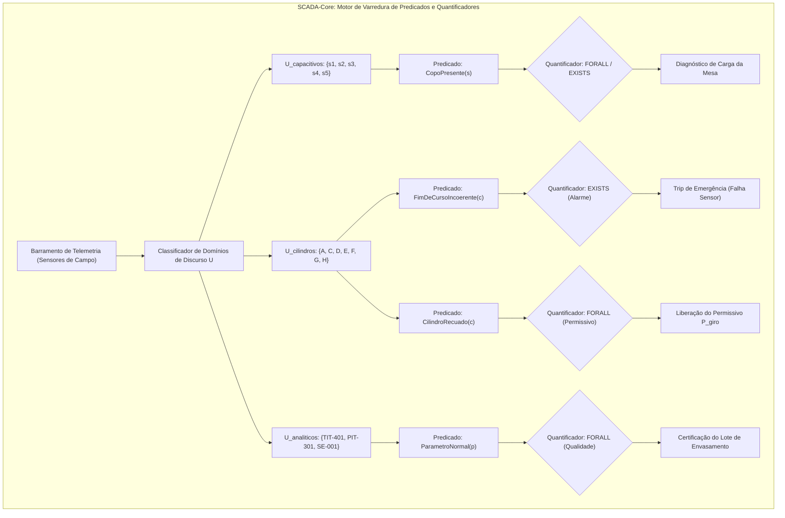

  <h2>Universidade Federal de Itajubá (UNIFEI)</h2>
  
Engenharia de Controle e Automação | Disciplina: Automática

  
Projeto: SCADA - Máquina de Envasamento de Copos Plásticos

  

# Aula 06: Lógica de Predicados e Quantificadores em Redes de Sensores Industriais

## 1. Fundamentos Matemáticos: Lógica de Primeira Ordem (FOL) na Automação

Enquanto a Lógica Proposicional trata proposições atômicas indivisíveis ($p, q, r$), a **Lógica de Predicados (Lógica de Primeira Ordem - FOL)** permite parametrizar propriedades sobre domínios e conjuntos finitos de instrumentos e atuadores distribuídos na planta:

$$\langle \mathcal{U}, \mathcal{P}, \mathcal{Q} \rangle$$

Onde:
1. **Universo de Discurso ($\mathcal{U}$):** Conjunto não vazio de elementos da planta (sensores capacitivos, atuadores pneumáticos, zonas térmicas, etc.).
2. **Predicado $P(x)$:** Função booleana $P: \mathcal{U} \rightarrow \{0, 1\}$ que avalia se o elemento $x \in \mathcal{U}$ satisfaz uma dada propriedade operacional ou de segurança.
3. **Quantificadores Lógicos ($\mathcal{Q}$):**
   * **Quantificador Universal ($\forall x \in \mathcal{U}, \; P(x)$):** Afirma que a propriedade $P(x)$ é estritamente verdadeira para **todos** os elementos do conjunto.
     Em um domínio finito $\mathcal{U} = \{x_1, x_2, \dots, x_n\}$, expande-se como uma **grande conjunção**:
     $$\forall x \in \mathcal{U} \, P(x) \equiv P(x_1) \land P(x_2) \land \dots \land P(x_n) \equiv \bigwedge_{i=1}^n P(x_i)$$
   * **Quantificador Existencial ($\exists x \in \mathcal{U}, \; P(x)$):** Afirma que existe **ao menos um** elemento em $\mathcal{U}$ que satisfaz $P(x)$.
     Em um domínio finito $\mathcal{U} = \{x_1, x_2, \dots, x_n\}$, expande-se como uma **grande disjunção**:
     $$\exists x \in \mathcal{U} \, P(x) \equiv P(x_1) \lor P(x_2) \lor \dots \lor P(x_n) \equiv \bigvee_{i=1}^n P(x_i)$$

### 1.1. Dualidade e Leis de De Morgan Generalizadas para Quantificadores

No diagnóstico de falhas do SCADA, a negação de condições de segurança universais equivale à detecção existencial de anomalias:

$$\neg \left( \forall x \in \mathcal{U} \, P(x) \right) \equiv \exists x \in \mathcal{U} \, \neg P(x)$$
$$\neg \left( \exists x \in \mathcal{U} \, P(x) \right) \equiv \forall x \in \mathcal{U} \, \neg P(x)$$

*Exemplo de Engenharia:* Dizer que *"Nem todos os atuadores estão em posição de recuo seguro"* ($\neg \forall x \, Recuado(x)$) é estritamente equivalente a afirmar que *"Existe pelo menos um atuador fora da posição segura impedindo o giro da mesa"* ($\exists x \, \neg Recuado(x)$).

---

## 2. Modelagem da Rede de Sensores da Máquina de Envasamento

### 2.1. Domínios Parametrizados da Envasadora

1. **Domínio dos Sensores Capacitivos ($\mathcal{U}_{\text{cap}}$):**
   $$\mathcal{U}_{\text{cap}} = \{\text{ZS-102}, \text{ZS-200}, \text{ZS-300}, \text{ZS-400}, \text{ZS-500}\} \quad \rightarrow \quad \{s_1, s_2, s_3, s_4, s_5\}$$
2. **Domínio dos Cilindros Pneumáticos de Dupla Ação ($\mathcal{U}_{\text{cil}}$):**
   $$\mathcal{U}_{\text{cil}} = \{\text{Cil}_A, \text{Cil}_C, \text{Cil}_D, \text{Cil}_E, \text{Cil}_F, \text{Cil}_G, \text{Cil}_H\}$$
   Cada cilindro $c \in \mathcal{U}_{\text{cil}}$ possui um par de sensores magnéticos: $(c_a, c_r)$.
3. **Domínio dos Sensores Analíticos/Contínuos ($\mathcal{U}_{\text{proc}}$):**
   $$\mathcal{U}_{\text{proc}} = \{\text{TIT-401 (Temp)}, \text{PIT-301 (Vácuo)}, \text{SE-001 (Encoder)}\}$$

---

## 3. Catálogo de Predicados e Regras Quantificadas de Supervisão

| Regra Formal (FOL) | Expansão Booleana Finita | Significado Físico / Aplicação SCADA |
| :--- | :--- | :--- |
| **Consistência dos Sensores:** $\forall c \in \mathcal{U}_{\text{cil}} \, \neg (c_a \land c_r)$ | $\neg(c_{1a} \land c_{1r}) \land \dots \land \neg(c_{9a} \land c_{9r})$ | **Ausência de Incoerência:** Nenhum cilindro pode apresentar avanço e recuo simultâneos. |
| **Alarme de Falha em Sensor:** $\exists c \in \mathcal{U}_{\text{cil}} \, (c_a \land c_r)$ | $(c_{1a} \land c_{1r}) \lor \dots \lor (c_{9a} \land c_{9r})$ | **Detecção de Curto/Desalinhamento:** Dispara alarme de manutenção se ao menos um par falhar. |
| **Prontidão de Repouso Geral:** $\forall c \in \mathcal{U}_{\text{cil}} \, Recuado(c)$ | $c_{1a} \land c_{3a} \land c_{5r} \land c_{6r} \land c_{7r} \land c_{8r} \land c_{9a}$ | **Permissivo de Giro Global:** Garante que todos os atuadores recolheram antes de mover a mesa. |
| **Mesa em Regime Pleno:** $\forall s \in \mathcal{U}_{\text{cap}} \, CopoPresente(s)$ | $s_1 \land s_2 \land s_3 \land s_4 \land s_5$ | **Planta em Capacidade Máxima:** Todos os 5 berços da mesa giratória estão ocupados. |
| **Mesa Totalmente Vazia:** $\forall s \in \mathcal{U}_{\text{cap}} \, \neg CopoPresente(s)$ | $\neg s_1 \land \neg s_2 \land \neg s_3 \land \neg s_4 \land \neg s_5$ | **Modo de Purga / Limpeza Concluído:** Confirma mesa descarregada para desligamento seguro. |
| **Necessidade de Dispensa:** $\exists s \in \mathcal{U}_{\text{cap}} \, \neg CopoPresente(s)$ | $\neg s_1 \lor \neg s_2 \lor \neg s_3 \lor \neg s_4 \lor \neg s_5$ | **Alimentação:** Existe pelo menos um berço vazio que requer novo copo na indexação. |

---

## 4. Entregável da Aula 06

* **Módulo `MotorPredicadosFOL` em Python (`06 - ... .ipynb`):**
  1. Implementação genérica dos operadores quantificadores de primeira ordem: `forall(U, P)` e `exists(U, P)`.
  2. Classes tipadas para sensores capacitivos, pares de fim de curso e variáveis de processo.
  3. Módulo injetor de falhas dinâmicas para simulação de anomalias distribuídas em campo (curto em sensor magnético, perda de vácuo, resfriamento de cabeçote).
  4. Bateria de testes automatizados com demonstração computacional das **Leis de De Morgan para Quantificadores**.
