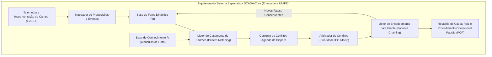

  <h2>Universidade Federal de Itajubá (UNIFEI)</h2>
  
Engenharia de Controle e Automação | Disciplina: Automática

  
Projeto: SCADA - Máquina de Envasamento de Copos Plásticos

  

# Aula 08: Sistemas Especialistas — Base de Conhecimento e Regras de Diagnóstico

## 1. Fundamentos Matemáticos: Arquitetura de Sistemas Baseados em Regras (RBS)

Em linhas automatizadas de envasamento e montagem discreta, a ocorrência de anomalias simultâneas (ausência de insumo, falha de vácuo, sobreaquecimento, perda de sincronismo mecânico) exige diagnóstico em tempo real e resposta prescritiva baseada em **Sistemas Especialistas Baseados em Regras** (*Rule-Based Expert Systems*).

Formalmente, o Sistema Especialista da Envasadora é modelado pela tripla:

$$\langle \mathcal{F}, \mathcal{R}, \mathcal{E} \rangle$$

Onde:
1. **$\mathcal{F}$ (Base de Fatos Dinâmica):** Conjunto finito de proposições que representam o estado instantâneo da máquina de envase (sensores, atuadores, alarmes, flags da IHM e fatos deduzidos):
   $$\mathcal{F}(t) = \{f_1, f_2, \dots, f_m\} \subseteq \mathcal{U}_{\text{fatos}}$$
2. **$\mathcal{R}$ (Base de Conhecimento / Regras de Produção):** Conjunto finito de regras de inferência expressas em **Cláusulas de Horn Definidas** da forma:
   $$R_i: \quad \text{SE } (A_{i,1} \land A_{i,2} \land \dots \land A_{i,k}) \quad \text{ENTÃO } \quad C_i$$
   Na forma canônica da lógica formal proposicional:
   $$\neg A_{i,1} \lor \neg A_{i,2} \lor \dots \lor \neg A_{i,k} \lor C_i$$
3. **$\mathcal{E}$ (Estratégia de Resolução de Conflitos e Encadeamento):** Critério determinístico de arbitragem (*Forward Chaining*) quando múltiplas regras tornam-se disparáveis simultaneamente, baseado na **Prioridade de Segurança SIL** ($\text{Prio} \in [1, 10]$), especificidade e recência.

---

## 2. Catálogo Especialista de Falhas e Diagnósticos da Envasadora

A base de conhecimento cobre os cenários mais críticos de intertravamento, integridade mecânica, qualidade do produto e segurança operacional da envasadora:

| ID Regra | Antecedentes ($\bigwedge A_i$) | Consequente ($C_i$) | Diagnóstico de Causa-Raiz | Severidade / Ação Prescritiva (POP) |
| :--- | :--- | :--- | :--- | :--- |
| **R-01** | `SOLICITA_GIRO_MESA` $\land$ `PRENSA_NAO_RECUADA` | `TRIP_COLISAO_MESA` | **Risco Crítico de Colisão Mecânica na Mesa Indexadora** | **EMERGÊNCIA (Prio 10):** Inibir motor $M\text{-}001$, manter prensa recolhida e acionar alarme. |
| **R-02** | `SOLICITA_PRENSA` $\land$ `TEMPERATURA_ABAIXO_MIN` | `BLOQUEIO_SELAGEM_FRIO` | **Temperatura Insuficiente no Cabeçote Térmico (< 180°C)** | **ALTA (Prio 8):** Inibir avanço do cilindro F, verificar resistência $HT\text{-}401$ e termopar $TIT\text{-}401$. |
| **R-03** | `SOLICITA_GIRO_BRACO` $\land$ `VACUO_NAO_CONFIRMADO` | `FALHA_CAPTURA_TAMPA` | **Perda de Sucção / Falta de Tampa no Manipulador Pick-and-Place** | **MÉDIA (Prio 6):** Pausar braço $XV\text{-}301$, inspecionar ventosa e magazine de tampas. |
| **R-04** | `CICLO_DISPENSA_CONCLUIDO` $\land$ `COPO_ESTACAO1_AUSENTE` | `MAGAZINE_COPOS_VAZIO` | **Desabastecimento ou Trancamento de Copos no Setor 100** | **ALTA (Prio 7):** Pausar indexação da mesa e solicitar reabastecimento na IHM. |
| **R-05** | `SOLICITA_DOSE_AGUA` $\land$ `BICO_FECHADO` | `SOBREPRESSAO_DOSADOR` | **Risco de Ruptura Hidráulica por Injeção com Bico Fechado** | **CRÍTICA (Prio 9):** Abortar avanço do cilindro C e comandar abertura forçada do bico $XV\text{-}203$. |
| **R-06** | `FIM_CURSO_AVANCO_ATIVO` $\land$ `FIM_CURSO_RECUO_ATIVO` | `FALHA_SENSOR_MAGNETICO` | **Incoerência Elétrica / Curto-Circuito em Fim de Curso** | **ALTA (Prio 8):** Travar modo automático e alertar manutenção para troca do sensor. |
| **R-07** | `TRIP_COLISAO_MESA` | `ALARME_GERAL_PARADA` | **Parada Total de Segurança por Intertravamento Crítico** | **EMERGÊNCIA (Prio 10):** Desarmar contator principal e acionar sinalizador audiovisual. |

---

## 3. Resolução de Conflitos e Inconsistências na Base

Uma Base de Conhecimento industrial de alto desempenho deve garantir propriedades formais de consistência:
1. **Consistência Semântica:** Não podem coexistir regras com antecedentes idênticos gerando conclusões contraditórias ($A \rightarrow C$ e $A \rightarrow \neg C$).
2. **Priorização por Severidade (IEC 61508 / SIL):** Situações que envolvem risco de colisão mecânica e integridade de operadores têm prioridade máxima ($\text{Prio} = 10$) sobre eventos de processo ou qualidade ($\text{Prio} \le 6$).
3. **Encadeamento em Cascata (Forward Chaining):** Regras podem disparar novas regras sucessivamente (ex: `R-01` gera `TRIP_COLISAO_MESA`, que por sua vez satisfaz o antecedente de `R-07`, culminando em `ALARME_GERAL_PARADA`).

---

## 4. Entregável da Aula 08

* **Estrutura Orientada a Objetos em Python (`08 - ... .ipynb`):**
  1. Classe `Fato`: Modelagem tipada de proposições dinâmicas com timestamp, origem e descrição.
  2. Classe `RegraDiagnostico`: Representação de Cláusulas de Horn com antecedentes, consequente, prioridade SIL, severidade e Procedimento Operacional Padrão (POP).
  3. Classe `BaseConhecimentoSCADA`: Gerenciador com motor de inferência por encadeamento para frente (*Forward Chaining*), arbitragem de conflitos e exportação tabular completa em ASCII.
