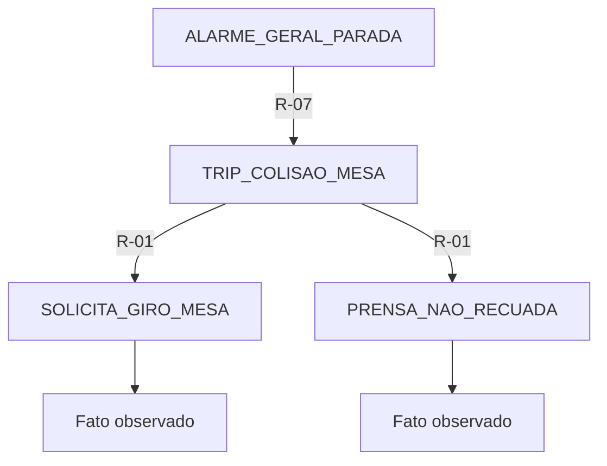
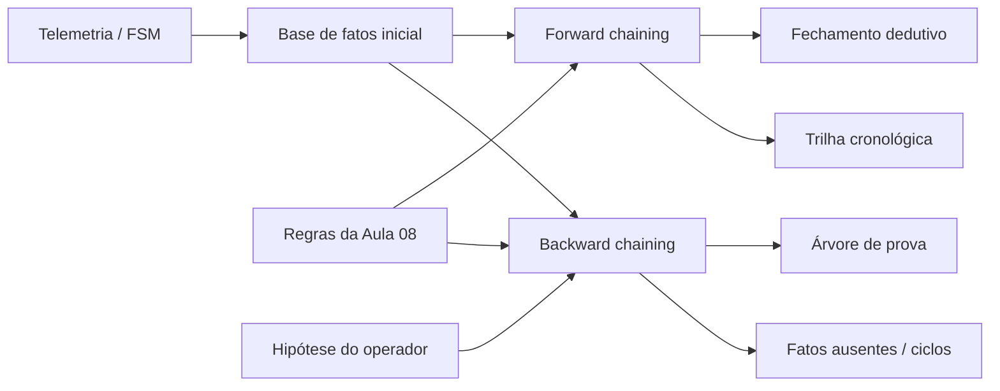

  <h2>Universidade Federal de Itajubá (UNIFEI)</h2>
  
Engenharia de Controle e Automação | Disciplina: Automática

  
Projeto: SCADA — Máquina de Envasamento de Água em Copos

  

# Aula 09: Motor de Inferência — *Forward* e *Backward Chaining*

## 1. Objetivo da aula

A Aula 08 definiu a base de conhecimento da envasadora como um conjunto de fatos e regras de produção. Nesta aula, essa base deixa de ser apenas um catálogo e passa a ser processada por um **motor híbrido de inferência**, capaz de:

1. partir da telemetria disponível e descobrir todas as consequências lógicas aplicáveis (*forward chaining*);
2. partir de uma hipótese de falha e verificar quais fatos e regras conseguem prová-la (*backward chaining*);
3. registrar uma trilha de auditoria com os passos, regras, premissas e conclusões de cada diagnóstico;
4. resolver conflitos de modo determinístico e impedir recursão infinita em bases que contenham ciclos.

O motor é uma camada de diagnóstico do SCADA. Ele **não substitui** o circuito de emergência, os intertravamentos executados no controlador ou a análise de risco da máquina.

---

## 2. Modelo lógico

O sistema especialista é representado pela tripla:

$$\langle \mathcal{F}, \mathcal{R}, \mathcal{E} \rangle$$

em que:

- $\mathcal{F}$ é o conjunto de fatos ativos, provenientes da telemetria, da FSM ou de inferências anteriores;
- $\mathcal{R}$ é o conjunto finito de regras de produção;
- $\mathcal{E}$ é a estratégia usada para selecionar e disparar regras.

Cada regra é uma cláusula de Horn definida:

$$R_i: (A_{i,1} \land A_{i,2} \land \cdots \land A_{i,k}) \rightarrow C_i$$

Os antecedentes $A_{i,j}$ devem estar ativos para que o consequente $C_i$ seja inferido.

### 2.1. Hipótese de mundo aberto

O motor adota **mundo aberto**: um fato que não está em $\mathcal{F}$ é considerado **não comprovado**, e não necessariamente falso. Isso é particularmente importante na instrumentação da envasadora. A ausência de `VACUO_NAO_CONFIRMADO`, por exemplo, não prova que o vácuo esteja normal; apenas informa que essa anomalia não foi fornecida ao motor.

---

## 3. Encadeamento para frente (*Forward Chaining*)

O encadeamento para frente é orientado a dados (*data-driven*). A execução começa com os fatos de entrada $\mathcal{F}_0$ e aplica sucessivamente *Modus Ponens*:

$$A_1, A_2, \ldots, A_k,\quad (A_1 \land \cdots \land A_k) \rightarrow C \quad \vdash \quad C$$

A cada passo, uma regra disparável adiciona um novo fato. O processo termina quando nenhuma regra consegue aumentar a base:

$$\mathcal{F}_{n+1} = T_{\mathcal{R}}(\mathcal{F}_n)$$

$$\mathcal{F}^{*} = T_{\mathcal{R}}(\mathcal{F}^{*})$$

O conjunto $\mathcal{F}^{*}$ é o **ponto fixo** ou fechamento dedutivo da base para aquele ciclo de diagnóstico.

### 3.1. Resolução determinística de conflitos

Quando várias regras estão habilitadas simultaneamente, o notebook utiliza:

1. maior prioridade local de segurança;
2. maior especificidade, medida pelo número de antecedentes;
3. identificador da regra em ordem alfabética, como critério final estável.

A prioridade de 1 a 10 utilizada no projeto é uma convenção interna de escalonamento. Ela não corresponde, por si só, a uma classificação SIL da IEC 61508.

### 3.2. Exemplo: colisão da mesa

Com os fatos:

$$\mathcal{F}_0 = \{\texttt{SOLICITA\_GIRO\_MESA},\ \texttt{PRENSA\_NAO\_RECUADA}\}$$

o motor dispara:

$$R\text{-}01 \Rightarrow \texttt{TRIP\_COLISAO\_MESA}$$

Esse novo fato habilita uma segunda regra:

$$R\text{-}07 \Rightarrow \texttt{ALARME\_GERAL\_PARADA}$$

Assim, uma entrada de processo gera uma cadeia auditável de diagnóstico e resposta.

---

## 4. Encadeamento para trás (*Backward Chaining*)

O encadeamento para trás é orientado a metas (*goal-driven*). Para provar uma hipótese $G$, o motor executa:

1. se $G \in \mathcal{F}_0$, a meta é um fato observado e está provada;
2. caso contrário, procura regras cujo consequente seja $G$;
3. para cada regra candidata, transforma seus antecedentes em submetas;
4. a regra prova $G$ somente se **todas** as submetas forem provadas;
5. se nenhuma regra provar $G$, a meta permanece não comprovada.

Para a hipótese `ALARME_GERAL_PARADA`, a árvore de prova esperada é:

### 4.1. Detecção de ciclos

Uma base incorreta poderia conter $A \rightarrow B$ e $B \rightarrow A$. Sem proteção, uma busca recursiva entraria em laço infinito. O motor mantém a pilha das metas em avaliação; quando encontra novamente uma meta ativa, encerra aquele ramo como `CICLO`, sem impedir que outras regras alternativas sejam testadas.

---

## 5. Base de conhecimento utilizada

A implementação reutiliza as sete regras de diagnóstico definidas na Aula 08:

| Regra | Antecedentes | Consequente | Prioridade |
| :--- | :--- | :--- | :---: |
| R-01 | `SOLICITA_GIRO_MESA` $\land$ `PRENSA_NAO_RECUADA` | `TRIP_COLISAO_MESA` | 10 |
| R-02 | `SOLICITA_PRENSA` $\land$ `TEMPERATURA_ABAIXO_MIN` | `BLOQUEIO_SELAGEM_FRIO` | 8 |
| R-03 | `SOLICITA_GIRO_BRACO` $\land$ `VACUO_NAO_CONFIRMADO` | `FALHA_CAPTURA_TAMPA` | 6 |
| R-04 | `CICLO_DISPENSA_CONCLUIDO` $\land$ `COPO_ESTACAO1_AUSENTE` | `MAGAZINE_COPOS_VAZIO` | 7 |
| R-05 | `SOLICITA_DOSE_AGUA` $\land$ `BICO_FECHADO` | `SOBREPRESSAO_DOSADOR` | 9 |
| R-06 | `FIM_CURSO_AVANCO_ATIVO` $\land$ `FIM_CURSO_RECUO_ATIVO` | `FALHA_INCOERENCIA_SENSOR` | 8 |
| R-07 | `TRIP_COLISAO_MESA` | `ALARME_GERAL_PARADA` | 10 |

---

## 6. Arquitetura implementada

As principais estruturas do notebook são:

- `RegraProducao`: representa antecedentes, consequente, diagnóstico, prioridade e POP;
- `BaseConhecimento`: armazena e valida o catálogo de regras;
- `MotorInferencia.forward_chaining()`: calcula o ponto fixo e a trilha de disparos;
- `MotorInferencia.backward_chaining()`: constrói uma árvore de prova para uma meta;
- `NoProva`: registra se cada meta foi provada por fato, por regra, não foi provada ou encontrou ciclo.

---

## 7. Ensaios realizados no notebook

| Ensaio | Entrada / Meta | Resultado esperado |
| :--- | :--- | :--- |
| 1. Cascata de segurança | Giro solicitado + prensa não recuada | R-01 e depois R-07 |
| 2. Conflito simultâneo | Falhas de dosagem, selagem e sensores | Ordem por prioridade: R-05, R-02, R-06 |
| 3. Prova regressiva válida | Meta `ALARME_GERAL_PARADA` | Provada por R-07 e R-01 |
| 4. Prova regressiva incompleta | Meta `FALHA_CAPTURA_TAMPA` sem falha de vácuo | Não comprovada; antecedente ausente registrado |
| 5. Consistência híbrida | Mesma entrada nos dois motores | Meta inferida à frente também provada para trás |
| 6. Base cíclica | Regras $A \rightarrow B$ e $B \rightarrow A$ sem fatos | Busca termina e informa ciclo |

Todos os ensaios possuem `assert`, fazendo o notebook falhar imediatamente caso um requisito lógico deixe de ser atendido.

---

## 8. Limitações de instrumentação e segurança

1. O fato `BICO_FECHADO` pressupõe confirmação positiva de fechamento. O catálogo atual possui somente o sensor `ZSC-203` para bico aberto. Portanto, $\neg c_4$ significa **abertura não detectada**, e não fechamento confirmado. Para sustentar a regra R-05 sem ambiguidade, recomenda-se um segundo fim de curso de bico fechado ou a renomeação do fato para `ABERTURA_BICO_NAO_CONFIRMADA`.
2. O motor trabalha com fatos booleanos monotônicos durante uma execução. Mudanças de estado, temporizações e remoção de fatos devem ocorrer entre ciclos controlados pela FSM/CLP.
3. Prioridades, POPs e regras devem ser submetidos à análise de risco, validação de processo e gestão de mudanças antes de qualquer uso industrial.
4. A lógica apresentada é o espelho funcional utilizado na simulação e no SCADA; a parada de emergência real deve permanecer em circuito de segurança dedicado.

---

## 9. Entregável da Aula 09

O notebook `09 - Motor de Inferencia Forward e Backward Chaining.ipynb` entrega:

- motor completo de *forward chaining* até o ponto fixo;
- motor completo de *backward chaining* com árvore de prova;
- resolução determinística de conflitos;
- trilha de auditoria das regras disparadas;
- indicação explícita de fatos ausentes;
- detecção de ciclos;
- seis ensaios automatizados aplicados à máquina de envasamento.
