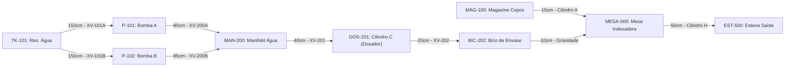

# Aula 11: Teoria dos Grafos — Modelagem da Planta e Fluxo de Processo

## 1. Fundamentos Matemáticos: Definição Formal de Dígrafos Ponderados

Um **Grafo Dirigido e Ponderado (Dígrafo)** é formalmente definido pela tripla:
$$G = (V, E, W)$$

Na nossa **Máquina de Envasamento de Copos**, a modelagem topológica é aplicada ao fluxo físico (água e recipientes):
1. **$V = \{v_1, v_2, \dots, v_n\}$** é o conjunto finito de **vértices (nós)**: reservatórios, bombas, cilindro dosador, bico de envase, magazine e a mesa giratória.
2. **$E \subseteq V \times V$** é o conjunto de **arestas dirigidas (arcos)**, representando a tubulação de água ou o trajeto mecânico do copo com sentido de fluxo permitido.
3. **$W: E \rightarrow \mathbb{R}^+$** é a **função de ponderação**, que associa a cada trajeto o comprimento físico em centímetros ($L\text{ [cm]}$).



A leitura do diagrama acima é direta: cada seta representa um trecho físico com sentido de escoamento ou movimentação fixo (definido por bomba, cilindro ou gravidade), e o rótulo indica o comprimento em centímetros e o elemento de manobra instalado naquele trecho.

---

## 2. Por que um Grafo e não uma Lista de Equipamentos?

O Automation Studio armazena os componentes mecânicos em listas e *arrays*. A diferença ao adotar a **estrutura de grafo** é que ela expõe propriedades topológicas que uma tabela simples esconde:

1. **Conectividade:** É possível provar formalmente se existe (ou não) um caminho do reservatório de água até o copo na mesa, sem inspecionar manualmente a planta.
2. **Redundância:** O grau de entrada do manifold ($\deg^-(\text{MAN-200}) = 2$, alimentado por P-101 e P-102) evidencia a existência de bombas reservas — uma propriedade de tolerância a falhas que fica implícita numa tabela.
3. **Composição de algoritmos:** Uma vez que a planta é um grafo, toda a teoria matemática (Euler, Dijkstra) torna-se aplicável para criar buscas (BFS/DFS) e roteamentos automáticos.

### 2.1. Definições Fundamentais de Teoria dos Grafos

Para tornar o vocabulário preciso no contexto da Envasadora, formalizamos os conceitos:

* **Ordem** do grafo: $\vert{}V\vert{} = n$, o número de vértices (módulos da máquina).
* **Tamanho** do grafo: $\vert{}E\vert{} = m$, o número de arestas (conexões físicas).
* **Passeio (*walk*):** sequência alternada $v_0, e_1, v_1, e_2, \dots, e_k, v_k$ onde cada $e_i = (v_{i-1}, v_i) \in E$. Representa fisicamente o percurso de uma gota de água, podendo repetir tubulações.
* **Caminho (*path*):** um passeio sem vértices repetidos. É o objeto de interesse quando queremos saber *a rota* da água até o copo, sem retrocessos.
* **Trilha (*trail*):** um passeio sem arestas repetidas. Relevante quando um robô de inspeção (AGV) pode passar duas vezes pelo mesmo setor, mas nunca inspeciona o mesmo trecho de duto duas vezes.
* **Ciclo (*cycle*):** um caminho fechado ($v_0 = v_k$). A existência de ciclos no grafo indica **rotas alternativas de contingência**.
* **Grau de saída** $\deg^+(v)$: número de arestas que partem de $v$ (saídas de fluxo).
* **Grau de entrada** $\deg^-(v)$: número de arestas que chegam a $v$ (alimentações).

### 2.2. Lema do Aperto de Mãos Dirigido

Para a rede de abastecimento da Envasadora $G = (V, E)$, vale a identidade:

$$\sum_{v \in V} \deg^+(v) = \sum_{v \in V} \deg^-(v) = \vert{}E\vert{}$$

**Justificativa:** cada aresta (tubulação/trajeto) contribui exatamente $+1$ para o grau de saída da sua origem e $+1$ para o grau de entrada do seu destino. Esta identidade é a base da verificação de consistência: se a soma não bater com o número de conexões, há um erro de modelagem.
Na tabela gerada, temos 9 conexões físicas cadastradas. Somando os graus de saída (`deg+`: $2+1+1+1+1+1+1+1+0 = 9$) e os graus de entrada (`deg-`: $0+1+1+2+1+1+0+2+1 = 9$), a identidade confirma-se matematicamente.

### 2.3. Representações Computacionais e Trade-offs

| Representação | Estrutura | Custo de espaço | Consulta "existe aresta $(u,v)$?" | Quando usar na Automação |
| --- | --- | --- | --- | --- |
| Matriz de adjacência | `float[n][n]` | $O(n^2)$ | $O(1)$ | Grafos densos ou quando se precisa de acesso instantâneo para algoritmos como Dijkstra. |
| Lista de adjacência | `dict[str, list]` | $O(n + m)$ | $O(\deg(u))$ | Grafos esparsos — típico em plantas reais muito grandes. |
| Matriz de incidência | `int[n][m]` | $O(n \cdot m)$ | — | Balanço de massa e análise de ciclos fechados. |

A classe `GrafoTubulacao` implementada no notebook desta aula adota a **matriz de adjacência dupla**: uma matriz binária (`adj_binaria`) e uma matriz de pesos (`adj_pesos`, inicializada com $\infty$ fora da diagonal e $0$ na diagonal, convenção padrão para algoritmos de caminho mínimo).

### 2.4. Grafo Simples vs. Multigrafo

Se adicionássemos uma mangueira pneumática redundante entre o Compressor e a Prensa (Setor 400), o modelo deixaria de ser um grafo simples e passaria a ser um **multigrafo**, pois existiria mais de uma aresta entre o mesmo par de vértices. A matriz de adjacência simples não captura essa redundância diretamente, sendo necessário armazenar uma lista de pesos por par $(u,v)$.

---

## 3. Exemplo Resolvido

**Pergunta:** Qual é o grau de saída total da rede e o que ele representa fisicamente?

**Resolução:** Somando a coluna `deg+` da tabela topológica gerada no notebook:
$\deg^+(\text{TK-101}) + \deg^+(\text{P-101}) + \deg^+(\text{P-102}) + \deg^+(\text{MAN-200}) + \deg^+(\text{DOS-201}) + \deg^+(\text{BIC-202}) + \deg^+(\text{MAG-100}) + \deg^+(\text{MESA-000}) + \deg^+(\text{EST-500})$
$= 2 + 1 + 1 + 1 + 1 + 1 + 1 + 1 + 0 = 9$.

Fisicamente, este total representa o número exato de elementos de transferência (válvulas, gravidade ou cilindros pneumáticos) que empurram o produto para o próximo estágio na máquina envasadora.

---

## 4. Atividades de Investigação

1. Prove, a partir do Lema do Aperto de Mãos Dirigido, que é impossível existir um dígrafo com exatamente um vértice de grau de saída ímpar e todos os demais com grau de saída par, se a soma dos graus de entrada for par.
2. Adicione uma tubulação redundante `TK-101_Agua -> MAN-200_Agua` (uma segunda linha física direta) e discuta por que a matriz de adjacência binária simples não representa corretamente esta redundância. Proponha uma estrutura de dados alternativa.
3. Classifique cada um dos 9 trechos da rede padrão como pertencente a um caminho, uma trilha ou nenhum dos dois, considerando a rota completa de `TK-101_Agua` até `EST-500_Saida` passando pelo dosador.
4. Se a esteira `EST-500_Saida` tivesse um sistema de descarte de copos defeituosos que os devolvesse ao `MAG-100_Copos` para reciclagem, quantos ciclos simples passariam a existir na rede? Enumere-os.

---

## 5. Entregável da Aula 11

* **Classe `GrafoTubulacao` em Python:** Estrutura orientada a objetos com suporte a nós parametrizados, inserção de tubulações com distância (cm) e atuador associado, matrizes de adjacência e exportação para algoritmos de roteamento.

```python
from typing import List, Dict, Any

class GrafoTubulacao:
    def __init__(self, vertices: List[str]):
        self.vertices = vertices
        self.v_to_idx = {v: i for i, v in enumerate(vertices)}
        self.idx_to_v = {i: v for i, v in enumerate(vertices)}
        self.n = len(vertices)
        
        # Matriz de adjacência binária (0 ou 1)
        self.adj_binaria = [[0] * self.n for _ in range(self.n)]
        
        # Matriz de pesos (distância em cm) inicializada com infinito
        self.adj_pesos = [[float('inf')] * self.n for _ in range(self.n)]
        for i in range(self.n):
            self.adj_pesos[i][i] = 0.0
        
        self.arestas_detalhes: List[Dict[str, Any]] = []

    def adicionar_conexao(self, origem: str, destino: str, distancia_cm: float, 
                           atuador: str, diametro_pol: float = 0.0):
        u = self.v_to_idx[origem]
        v = self.v_to_idx[destino]
        
        self.adj_binaria[u][v] = 1
        self.adj_pesos[u][v] = distancia_cm
        
        self.arestas_detalhes.append({
            "Origem": origem,
            "Destino": destino,
            "Distância (cm)": distancia_cm,
            "Atuador / Via": atuador,
            "Diâmetro (pol)": diametro_pol
        })

    def obter_graus(self) -> List[Dict[str, Any]]:
        graus = []
        for i, v in enumerate(self.vertices):
            deg_out = sum(self.adj_binaria[i])
            deg_in = sum(self.adj_binaria[r][i] for r in range(self.n))
            graus.append({
                "Equipamento / Nó": v, 
                "Grau Entrada (deg-)": deg_in, 
                "Grau Saída (deg+)": deg_out
            })
        return graus
```
