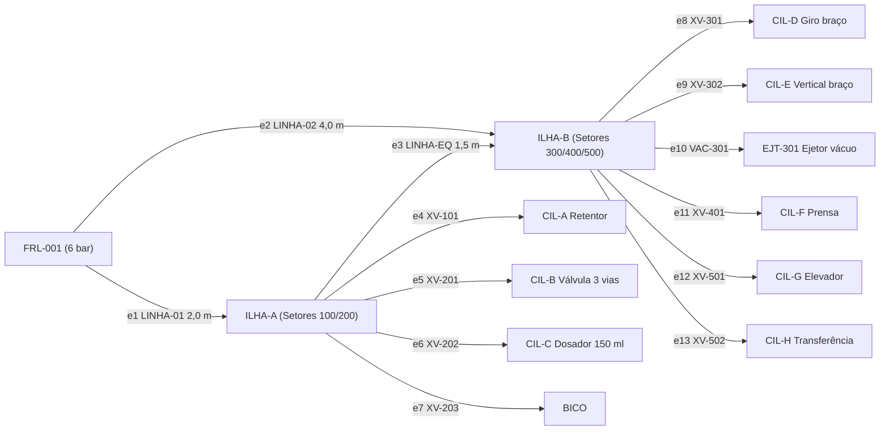
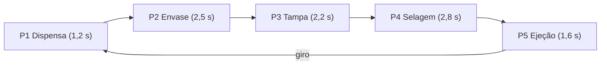

  <h2>Universidade Federal de Itajubá (UNIFEI)</h2>
  
Engenharia de Controle e Automação | Disciplina: Automática

  
Projeto: SCADA - Máquina de Envasamento de Copos Plásticos

  

# Aula 12: Matrizes de Incidência, Adjacência e Custos — Rede Pneumática da Envasadora

## 1. Fundamentos Matemáticos: A Matriz de Incidência Vértice-Aresta ($B$)

Seja um dígrafo $G = (V, E)$ com $|V| = n$ vértices e $|E| = m$ arestas dirigidas. A **Matriz de Incidência** $B \in \{-1, 0, 1\}^{n \times m}$ é definida por:

$$B[i, j] = \begin{cases} -1, & \text{se a aresta } e_j \text{ sai do nó } v_i \text{ (origem)} \\ +1, & \text{se a aresta } e_j \text{ entra no nó } v_i \text{ (destino)} \\ 0, & \text{se o nó } v_i \text{ não incide na aresta } e_j \end{cases}$$

### Propriedades Formais:
1. **Soma por Coluna Nula:** Para toda coluna $j$, $\sum_{i=1}^n B[i, j] = 0$.
2. **Balanço de Massa em Regime Permanente:** $B \cdot \vec{Q} = \vec{S}$.
3. **Posto:** para grafo conexo, $\text{posto}(B) = n - 1$.
4. **Espaço de Ciclos:** $\dim \ker(B) = m - n + 1$.

---

## 2. A Envasadora Vista como Grafo

Na máquina de envase, o "fluido" que circula não é amônia ou ácido, mas **ar comprimido**: ele sai da unidade de tratamento `FRL-001`, passa pelas ilhas de válvulas e é consumido pelos cilindros pneumáticos A–H, pelo bico dosador e pelo ejetor de vácuo do pick-and-place. Já os **copos** percorrem um segundo grafo: as 5 estações da mesa indexadora.

### 2.1. Grafo 1 — Rede Pneumática ($n = 13$, $m = 13$)

* **Fonte:** `FRL-001` ($S < 0$). **Nós de passagem:** `ILHA-A`, `ILHA-B` ($S = 0$). **Sumidouros:** os 10 consumidores ($S > 0$).
* A **linha de equalização** `e3` fecha um anel `FRL-001 → ILHA-A → ILHA-B`, prática recomendada em redes de ar comprimido para reduzir quedas de pressão quando vários atuadores trabalham ao mesmo tempo (ex.: prensa + elevador).

### 2.2. Grafo 2 — Mesa Indexadora ($C_5$)

---

## 3. Aprofundamento Teórico

### 3.1. Interpretação Física da Soma Nula

Cada mangueira $e_j = (u, v)$ contribui com $-1$ na linha de $u$ e $+1$ na linha de $v$. Isso é a **1ª Lei de Kirchhoff** aplicada ao ar: todo o ar que sai de um nó entra no outro. A mesma matemática vale para circuitos elétricos, redes hidráulicas e redes de dados.

### 3.2. Incidência vs. Adjacência vs. Custos

| Aspecto | Incidência $B$ | Adjacência $A$ | Custos $W$ |
| --- | --- | --- | --- |
| Dimensão | $n \times m$ | $n \times n$ | $n \times n$ |
| Entradas | $\{-1, 0, +1\}$ | $\{0, 1\}$ | $\mathbb{R}^+ \cup \{\infty\}$ |
| Na envasadora | balanço de ar, detecção de vazamento | conectividade das ilhas, posição dos copos ($A^k$) | comprimento de mangueira, tempo entre estações |
| Algoritmos | sistemas lineares, ciclos | potências de matriz, BFS/DFS | Dijkstra, Floyd-Warshall |

A ponte entre $B$ e $A$ é o **Laplaciano** $L = BB^T = D - A_{und}$, verificado numericamente no notebook.

### 3.3. Posto e Espaço de Ciclos na Envasadora

Para a rede pneumática, $\text{posto}(B) = 12 = n - 1$ (rede conexa: todo cilindro recebe ar) e a dimensão do espaço de ciclos é $13 - 13 + 1 = 1$, que corresponde exatamente ao **anel de equalização**. O ciclo fundamental encontrado pelo notebook é $\vec{c} = +e_1 - e_2 + e_3$, e satisfaz $B\vec{c} = \vec{0}$.

> **Consequência prática:** sem a linha `e3`, a rede seria uma árvore ($m = n - 1$) e as vazões ficariam totalmente determinadas pelo consumo. Com o anel, aparece **uma incógnita a mais**.

### 3.4. Balanço de Massa e a Lei das Malhas *(melhoria)*

$B\vec{Q} = \vec{S}$ fornece apenas $n - 1 = 12$ equações independentes para $m = 13$ incógnitas: o sistema é **subdeterminado**. O notebook original resolvia isso fixando $\vec{Q}$ manualmente. Aqui completamos o sistema com a **2ª Lei de Kirchhoff** (soma das quedas de pressão no ciclo = 0), usando a resistência linear de Hagen-Poiseuille:

$$R_j = \frac{128\,\mu\,L_j}{\pi D_j^4}, \qquad \sum_{j} c_j\,R_j\,Q_j = 0$$

$$\begin{bmatrix} B_{red} \\ C\,\mathrm{diag}(R) \end{bmatrix}\vec{Q} = \begin{bmatrix} \vec{S}_{red} \\ \vec{0} \end{bmatrix}$$

> [!NOTE]
> O modelo laminar é uma simplificação didática (o escoamento real é pulsante e pode ser turbulento). Ele serve para mostrar **como a topologia do grafo fecha o sistema**; para dimensionar a rede de fato, use as tabelas de perda de carga do fabricante.

### 3.5. Consumo de Ar Calculado *(melhoria)*

Em vez de vazões arbitrárias, cada consumidor tem seu consumo calculado (dupla ação, $p = 6$ bar, 12 copos/min):

$$Q_{cil} = 2 \cdot \frac{\pi d^2}{4} \cdot s \cdot \frac{p_{man} + p_{atm}}{p_{atm}} \cdot f_{ciclos}$$

| Consumidor | Ø × curso (mm) | NL/min |
| --- | --- | --- |
| CIL-C Dosador | 32 × 100 | 13,36 |
| CIL-F Prensa | 40 × 50 | 10,44 |
| EJT-301 Vácuo | contínuo (40 %) | 6,00 |
| CIL-H Transferência | 20 × 100 | 5,22 |
| Demais (A, B, Bico, D, E, G) | — | 9,57 |
| **Total** | | **44,59** |

### 3.6. Matriz de Custos e Floyd-Warshall *(melhoria)*

Com $W$ = comprimento das mangueiras, o Floyd-Warshall mostra que o caminho mais curto do `FRL-001` até a `ILHA-B` é **via ILHA-A** (2,0 + 1,5 = 3,5 m) e não pela linha direta (4,0 m). Em $O(n^3)$, obtemos a distância entre **todos os pares**, ao passo que Dijkstra resolve **uma única origem**.

### 3.7. Detecção de Vazamento pelo Resíduo *(melhoria)*

Com medidores de vazão nas linhas, o SCADA calcula $\vec{r} = B\vec{Q}_{med} - \vec{S}_{nom}$. Um vazamento de 4 NL/min em `ILHA-B` produz $r_{ILHA-B} = +4{,}00$ e $r_{FRL} = -4{,}00$, sendo todos os outros nós iguais a zero. Isso **localiza o nó defeituoso**. A perda estimada é de cerca de **960 Nm³/ano**. A detecção pode virar regra da Base de Conhecimento da Aula 08:

`SE residuo(ILHA_B) > 0,5 NL/min ENTÃO ALARME_VAZAMENTO_ILHA_B`

### 3.8. Grafo da Mesa: Potências de $A$ e Gargalo *(melhoria)*

* $(A^k)_{ij}$ indica onde o copo estará após $k$ indexações. Para o ciclo $C_5$, $A^5 = I$ (o copo volta à posição de origem).
* Como as estações trabalham em paralelo: $T_{takt} = \max_i t_i + t_{index} = 2{,}8 + 0{,}8 = 3{,}6$ s, o que dá **cadência máxima de 16,7 copos/min**, e a **Selagem é o gargalo**.
* Lead time **ideal** (Floyd-Warshall) = 13,5 s; lead time **real** (mesa síncrona) = $4 \times 3{,}6 + 1{,}6 = 16{,}0$ s, ou seja, **2,5 s de espera** provocados pelo gargalo.
* Na cadência máxima, o consumo de ar sobe de 44,59 para **59,60 NL/min**, que deve ser usado para dimensionar o compressor.

---

## 4. Exemplo Resolvido

**Pergunta:** Verifique a coluna $e_3$ (`ILHA-A → ILHA-B`) de $B$ e calcule, pela Lei das Malhas, a vazão no anel de equalização.

**Resolução:**
1. Coluna $e_3$: $-1$ em `ILHA-A`, $+1$ em `ILHA-B` e $0$ nas outras 11 linhas. A soma é $-1 + 1 = 0$. ✓
2. Consumo de cada ilha: $Q_A = 0{,}84 + 0{,}67 + 13{,}36 + 0{,}13 = 15{,}00$ NL/min e $Q_B = 29{,}60$ NL/min.
3. Balanço nos nós: $Q_1 = Q_A + Q_3$ e $Q_2 = Q_B - Q_3$.
4. Malha ($+e_1 - e_2 + e_3$) com o mesmo diâmetro nas três linhas, de modo que $R \propto L$: $L_1 Q_1 + L_3 Q_3 - L_2 Q_2 = 0$

$$Q_3 = \frac{L_2 Q_B - L_1 Q_A}{L_1 + L_2 + L_3} = \frac{4{,}0 \cdot 29{,}60 - 2{,}0 \cdot 15{,}00}{7{,}5} \approx 11{,}78 \text{ NL/min}$$

Resultado: $Q_1 = 26{,}78$ e $Q_2 = 17{,}81$ NL/min, iguais aos valores do notebook. ✓ Mais de 60 % do ar que chega à `ILHA-B` passa pela `ILHA-A`, porque esse caminho é mais curto.

---

## 5. Atividades de Investigação

1. Remova a linha de equalização `e3`. Recalcule $\text{posto}(B)$ e $m - n + 1$. O sistema $B\vec{Q} = \vec{S}$ passa a ter solução única? Qual o novo $Q_2$?
2. Demonstre algebricamente que $BB^T = D - A_{und}$ e compare com a saída numérica do notebook.
3. Adicione uma segunda linha `FRL-001 → ILHA-B` em paralelo (redundância). Quantos ciclos independentes passam a existir? Quantas equações de malha são necessárias?
4. Simule um vazamento **em uma mangueira** (aresta), e não em um nó: o resíduo $\vec{r}$ consegue diferenciar os dois casos? Que instrumentação adicional seria necessária?
5. Reduza o tempo da selagem para 2,0 s (pré-aquecimento). Qual passa a ser o gargalo, a nova cadência máxima e o novo consumo de ar?
6. Compare o custo de obter as distâncias entre **todos os pares** usando (a) Dijkstra $n$ vezes e (b) Floyd-Warshall uma vez, para $n = 13$ e $m = 13$ (grafo esparso).

---

## 6. Melhorias em Relação à Versão Original (Planta NPK)

| # | Melhoria | Benefício |
| --- | --- | --- |
| M1 | Consumo de ar calculado pela geometria dos cilindros e pela cadência | $\vec{S}$ com significado físico, não arbitrário |
| M2 | Exibição das matrizes de adjacência $A$ e de custos $W$ | o original as construía, mas nunca as mostrava |
| M3 | Cálculo exato do posto de $B$ (frações) e do espaço de ciclos | valida a conectividade e identifica o anel |
| M4 | Floyd-Warshall com reconstrução de rotas | antes era só citado na teoria |
| M5 | Lei das Malhas para fechar o sistema subdeterminado | $\vec{Q}$ passa a ser resolvido, não fixado à mão |
| M6 | Detecção e localização de vazamento pelo resíduo | aplicação direta em manutenção preditiva |
| M7 | Verificação numérica de $L = BB^T = D - A$ | conecta incidência e adjacência |
| M8 | Grafo da mesa: $A^k$, gargalo, takt, lead time ideal × real | liga a teoria de grafos à produtividade |

---

## 7. Entregável da Aula 12

* **Notebook `12 - Matrizes de Incidencia Adjacencia e Custos (1).ipynb`:**
  1. Classes `ConsumidorPneumatico` e `GrafoPneumatico`: modelagem da rede de ar com consumo físico.
  2. `CalculadorIncidencia`: geração de $B$, validação da soma nula, posto e graus.
  3. Matrizes $A$ e $W$ e `floyd_warshall` com reconstrução de rotas.
  4. `ciclos_fundamentais` e `resolver_vazoes`: balanço $B\vec{Q} = \vec{S}$ completado pela Lei das Malhas.
  5. Detector de vazamento por resíduo, verificação do Laplaciano e análise de gargalo da mesa indexadora.
