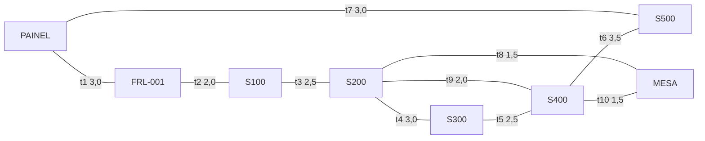
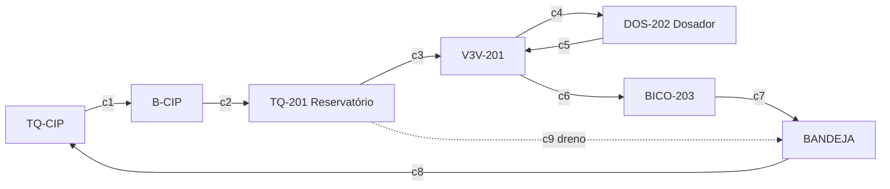

  <h2>Universidade Federal de Itajubá (UNIFEI)</h2>
  
Engenharia de Controle e Automação | Disciplina: Automática

  
Projeto: SCADA - Máquina de Envasamento de Copos Plásticos

  

# Aula 16: Problemas Eulerianos e Inspeção da Máquina de Envase

## 1. Fundamentos Matemáticos: Teorema de Euler e Circuitos Eulerianos

Um **Circuito Euleriano** é um passeio fechado que usa **cada aresta exatamente uma vez**. Em um grafo não-dirigido **conexo**, ele existe se e somente se **todos os vértices tiverem grau par**. Em grafos dirigidos, exige-se $\deg^+(v) = \deg^-(v)$ para todo nó (além de conectividade).

| Situação (grafo conexo) | Vértices de grau ímpar | Resultado |
| --- | --- | --- |
| Todos os graus pares | 0 | **Circuito** euleriano (fechado) |
| Exatamente dois ímpares | 2 | **Trilha** euleriana (aberta, de um ímpar ao outro) |
| Mais de dois ímpares | $2k,\ k \ge 2$ | Nenhum → **Problema do Carteiro Chinês** |

---

## 2. A Envasadora Vista como Grafo de Inspeção

Na planta NPK o robô inspecionava dutos de corrosão. Na envasadora aparecem **três problemas eulerianos reais**:

| Problema | Vértices | Arestas | Tipo de grafo |
| --- | --- | --- | --- |
| **Ronda preventiva** | pontos de inspeção (painel, FRL, setores, mesa) | chicotes, mangueiras, cabos de rede | não-dirigido, euleriano |
| **Caça a vazamentos** (continuação da Aula 12) | FRL, ilhas, cilindros | mangueiras pneumáticas | não-dirigido, **10 vértices ímpares** |
| **Limpeza CIP** | tanques, bomba, válvula 3 vias, dosador, bico | trechos hidráulicos | **dirigido** (fluxo em um único sentido) |

### 2.1. Ronda Preventiva (8 vértices, 10 trechos)

O anel externo percorre todas as estações. O **anel interno** (MESA–S200–S400) representa os chicotes do motor `M-001`, do encoder `SE-001` e o cabo de rede IO-Link. Os pesos são tempos de inspeção em minutos.

### 2.2. Circuito CIP (dígrafo)

---

## 3. Aprofundamento Teórico

### 3.1. Contexto Histórico: As Pontes de Königsberg

A Teoria dos Grafos nasce em **1736**, quando Euler provou que era impossível atravessar as sete pontes de Königsberg exatamente uma vez e voltar ao início: as quatro regiões de terra tinham grau ímpar (3, 3, 3 e 5). A ronda do técnico na envasadora é **o mesmo problema**: passar por cada chicote ou mangueira uma única vez.

### 3.2. Prova do Teorema (Caso Não-Dirigido)

**Teorema (Euler, 1736):** Um multigrafo **conexo** $G$ possui circuito euleriano $\iff$ todo vértice tem grau par.

**Necessidade:** cada passagem do circuito por um vértice consome uma aresta de entrada e uma de saída (contribuição $+2$ ao grau). Como o circuito é fechado, até o vértice inicial tem suas arestas emparelhadas. Logo, todo grau é par.

**Suficiência (construtiva):** com graus pares, a partir de qualquer vértice nunca se fica "preso" fora da origem: ao entrar por uma aresta livre, resta um número ímpar de arestas livres, portanto ao menos uma saída. Se o ciclo obtido não usar todas as arestas, o restante ainda tem graus pares e, **por conexidade**, toca o ciclo em algum vértice. Constrói-se um novo ciclo ali e ele é "costurado" ao anterior. $\blacksquare$

> [!IMPORTANT]
> **Melhoria M2:** o notebook original verificava apenas a paridade. Sem **conectividade**, dois anéis separados (ex.: o circuito pneumático e um circuito elétrico isolado) teriam todos os graus pares e **nenhum** circuito euleriano. A nova função `classificar()` verifica as duas condições.

### 3.3. Adaptação para Dígrafos: o Circuito CIP *(melhoria M7)*

Na limpeza CIP a solução **não pode escoar ao contrário**, então o grafo é dirigido e o critério passa a ser $\deg^+(v) = \deg^-(v)$. No projeto, a válvula de 3 vias `V3V-201` tem grau de entrada igual a 2 (reservatório e retorno do dosador) e grau de saída igual a 2 (dosador e bico), portanto está balanceada. O **dreno de fundo** `c9` desbalanceia o grafo:

* `TQ-201`: $\deg^+ - \deg^- = +1$ (sai mais do que entra);
* `BANDEJA`: $\deg^+ - \deg^- = -1$ (entra mais do que sai).

O **Carteiro Chinês dirigido** liga cada vértice com excesso de entrada a um vértice com excesso de saída pelo caminho mínimo `BANDEJA → TQ-CIP → B-CIP → TQ-201`. Esses três trechos são **relavados**, com custo extra de 5,5 min, e o CIP completo leva 20,0 min.

### 3.4. O Algoritmo de Hierholzer *(melhorias M3 e M4)*

1. Empilha o vértice inicial.
2. Enquanto o topo $u$ tiver aresta **não usada**, marca a aresta como usada e empilha o vizinho.
3. Sem arestas livres, desempilha $u$ e anexa ao circuito.
4. Inverte o circuito ao final.

| Aspecto | Original | Nova versão |
| --- | --- | --- |
| Remoção de aresta | `adj[v].remove((u, id))` → $O(\deg)$ por passo | vetor `usado[]` + ponteiro por vértice → $O(1)$ amortizado |
| Complexidade total | até $O(\lvert E\rvert \cdot \Delta)$ | $O(\lvert E\rvert)$ |
| Saída | apenas vértices | vértices **e IDs dos trechos**, essenciais quando há arestas paralelas |
| Validação | `assert eul` | `validar_rota()`: cada aresta uma vez, passos adjacentes, início = fim |

### 3.5. O Problema do Carteiro Chinês *(melhoria M6)*

Quando há $2k$ vértices ímpares (sempre um número par, pelo Lema do Aperto de Mãos):

1. Calcula-se a distância mínima entre todos os pares de vértices ímpares com **Dijkstra** (Aula 14).
2. Encontra-se o **emparelhamento perfeito de custo mínimo**. No notebook, isso é feito de forma **exata** por programação dinâmica em bitmask, $O(2^{2k} \cdot 2k)$, viável para $2k \le 20$. Para redes grandes, usa-se o algoritmo de Edmonds, $O(n^3)$.
3. **Duplicam-se** as arestas dos caminhos emparelhados.
4. Aplica-se Hierholzer no grafo aumentado.

$$\text{Custo ótimo} = \sum_{e \in E} w(e) + \text{custo do emparelhamento mínimo}$$

**Caça a vazamentos (rede da Aula 12):** a rede é quase uma árvore e cada um dos 10 cilindros é uma folha de grau 1. O emparelhamento ótimo junta folhas da mesma ilha (`CIL-A↔CIL-B`, `CIL-C↔BICO`, `CIL-D↔CIL-G`, `CIL-E↔EJT-301`, `CIL-F↔CIL-H`), de modo que **toda mangueira terminal é percorrida duas vezes**:

| Grandeza | Valor |
| --- | --- |
| Soma dos trechos (limite inferior) | 36,4 min |
| Repetições (Carteiro Chinês) | 21,4 min |
| **Varredura ótima** | **57,8 min (+59 %)** |

> [!TIP]
> **Leitura de engenharia:** o custo extra é exatamente o dobro do comprimento das mangueiras terminais. Para reduzir o tempo de manutenção, deixe as válvulas próximas aos atuadores (ilhas descentralizadas), assim as linhas terminais ficam curtas.

---

## 4. Exemplo Resolvido

**Pergunta:** Verifique pelo Lema do Aperto de Mãos que a ronda preventiva tem todos os graus pares e indique o tempo mínimo da ronda.

**Resolução:** cada trecho soma $+1$ ao grau de cada extremo:

| Vértice | Trechos incidentes | Grau |
| --- | --- | --- |
| PAINEL | t1, t7 | 2 |
| FRL-001 | t1, t2 | 2 |
| S100 | t2, t3 | 2 |
| S200 | t3, t4, t8, t9 | 4 |
| S300 | t4, t5 | 2 |
| S400 | t5, t6, t9, t10 | 4 |
| S500 | t6, t7 | 2 |
| MESA | t8, t10 | 2 |

Soma dos graus $= 20 = 2|E|$ ✓. Todos os graus são pares e o grafo é conexo, logo existe circuito euleriano. Como nenhum trecho se repete, o tempo mínimo é a soma dos pesos, **24,5 min**. O notebook gera:

`PAINEL → FRL-001 → S100 → S200 → S300 → S400 → S200 → MESA → S400 → S500 → PAINEL`

**Extensão:** ao instalar um by-pass `t11` (S200–S300, 2,0 min), S200 e S300 ficam ímpares. Há duas opções: uma **trilha** aberta de S200 até S300 (26,5 min) ou, para voltar ao painel, repetir `t11` (Carteiro Chinês, 28,5 min).

---

## 5. Atividades de Investigação

1. Adicione um trecho paralelo `S400–S500` (segundo chicote da resistência). O grafo continua euleriano? Quais vértices ficam ímpares, qual trecho deve ser repetido e quanto custa?
2. Na caça a vazamentos, simule a instalação das válvulas **junto aos cilindros** (todas as linhas terminais com 0,3 m). Qual é a nova varredura ótima? Quanto se economiza por intervenção?
3. Gere a ronda partindo de `S200` em vez de `PAINEL`. O circuito muda? E o custo total? Justifique.
4. No CIP, proponha uma alteração **física** (nova linha ou bomba) que torne o dígrafo balanceado sem relavagem. Compare o custo da alteração com 5,5 min de relavagem por CIP diário ao longo de um ano.
5. Desenhe o grafo das Sete Pontes de Königsberg, calcule os graus e mostre quantas pontes precisariam ser duplicadas (Carteiro Chinês) para permitir o passeio fechado.
6. Por que o Problema do Carteiro Chinês é polinomial, enquanto o problema de visitar cada **vértice** uma única vez (Hamiltoniano, Aula 17) é NP-completo?

---

## 6. Melhorias em Relação à Versão Original (Planta NPK)

| # | Melhoria | Benefício |
| --- | --- | --- |
| M1 | Arestas ponderadas (tempo de inspeção) e custo total | rota com significado operacional |
| M2 | Verificação de conectividade | critério de Euler completo (o original era só condição necessária) |
| M3 | Hierholzer $O(\lvert E\rvert)$ com IDs de arestas | suporta multigrafos e indica **qual** trecho inspecionar |
| M4 | Validador formal da rota | garantia de que nenhum trecho foi esquecido ou repetido |
| M5 | Classificação circuito / trilha / nenhum | trata o caso semi-euleriano |
| M6 | Carteiro Chinês com emparelhamento mínimo exato | resolve redes reais com vértices ímpares (rede pneumática) |
| M7 | Euler e Carteiro Chinês em dígrafos | aplicação à limpeza CIP com sentido de fluxo |
| M8 | Saída como Ordem de Serviço com tempo acumulado | pronta para a IHM ou o sistema de manutenção |

---

## 7. Entregável da Aula 16

* **Notebook `16 - Problemas Eulerianos e Inspecao de Infraestrutura (1).ipynb`:**
  1. Classe `GrafoInspecaoEuleriano`: multigrafo ponderado com `classificar()`, `hierholzer()`, `validar_rota()` e `dijkstra()`.
  2. `emparelhamento_minimo()` e `carteiro_chines()`: aumento ótimo de grafos com vértices ímpares.
  3. Classe `GrafoCIP`: circuito euleriano dirigido e `balancear_carteiro_dirigido()`.
  4. Ordens de serviço da ronda preventiva, da caça a vazamentos e da sequência de lavagem CIP.
